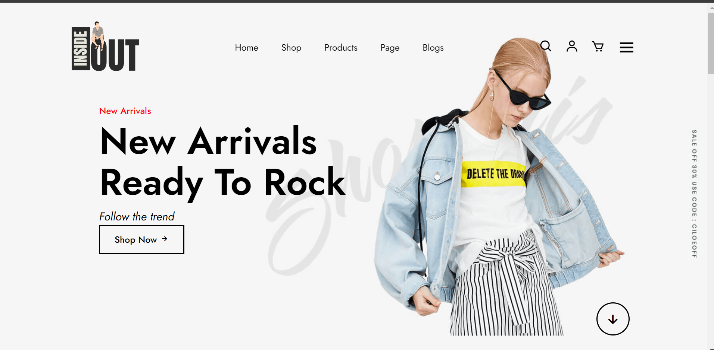

# InsideOut E-Commerce Website

## Description
InsideOut is a stylish e-commerce website designed to showcase and sell clothing products for kids. The website features a modern layout with a focus on user experience, making it easy for customers to browse and shop for new arrivals and trending products.

## Key Features

- **Header**: 
  - Logo and navigation menu with links to Home, Shop, Products, Page, and Blogs.
  - Interactive icons for search, user account, and shopping cart.

- **Main Section**:
  - Highlights "New Arrivals" with a call-to-action button encouraging users to shop.
  - Downward arrow to prompt users to explore trending products.

- **Brands Section**:
  - Displays logos of various brands to enhance brand recognition.

- **Trending Products**:
  - Showcases several products with images, sale tags, ratings, and prices.
  - Each product includes a heart icon for favorites and a button for viewing all products.

- **Newsletter Signup**:
  - Encourages users to subscribe for updates via email.

- **Contact Section**:
  - Provides company information, including address, contact number, and email.
  - Features social media icons for easy access to the brand's social platforms.
  - Lists support and shopping-related links for user assistance.

- **Footer**:
  - Includes copyright information and credits for the website design.

## Design Elements
- Utilizes modern web fonts and icons from Font Awesome and Boxicons.
- Responsive layout ensuring a good user experience across devices.
- CSS styling is managed through an external stylesheet (`style.css`), allowing for customizable design.

Technologies Used
HTML5
CSS3
JavaScript
Font Awesome
Boxicons
License
This project is licensed under the MIT License. See the LICENSE file for details.

Acknowledgments
Designed by Vinod Choudhary. Special thanks to the contributors and resources that made this project possible.

python

